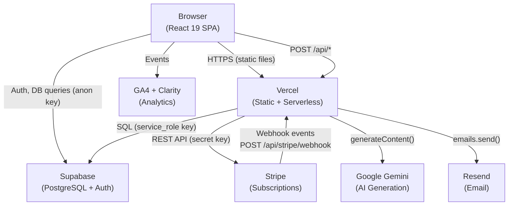
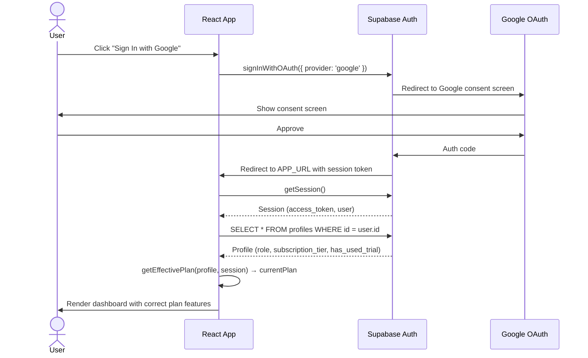
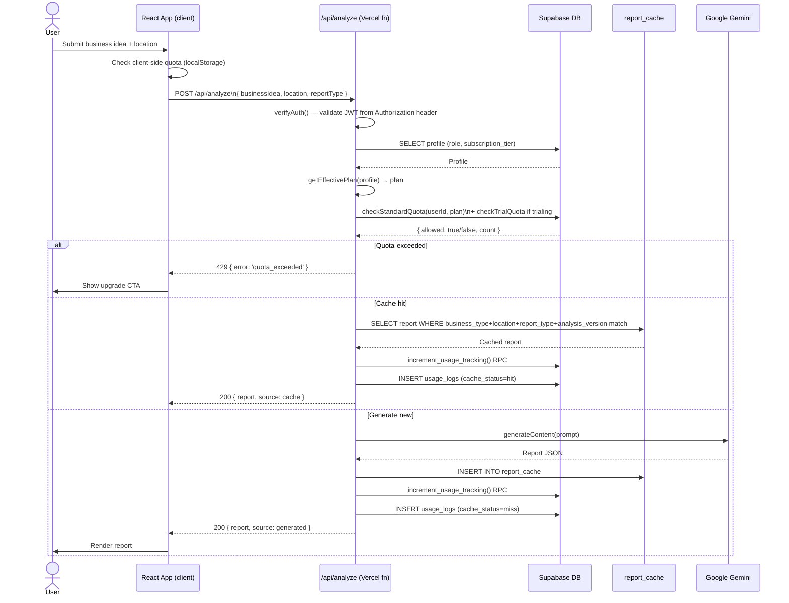
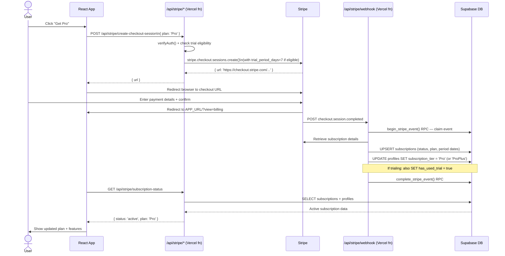
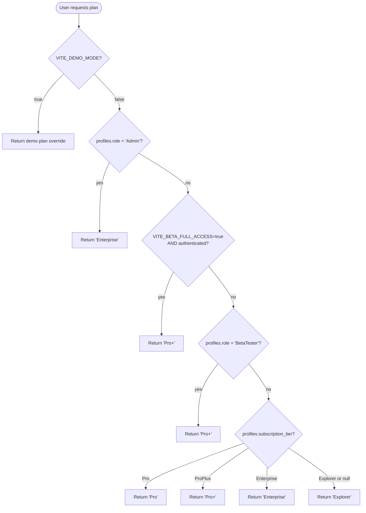
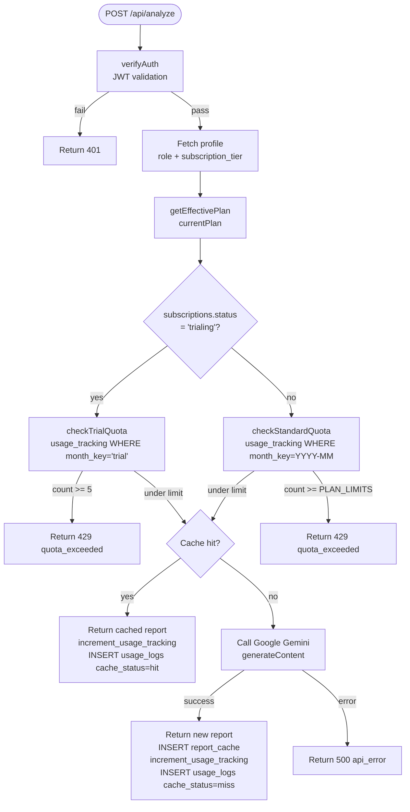
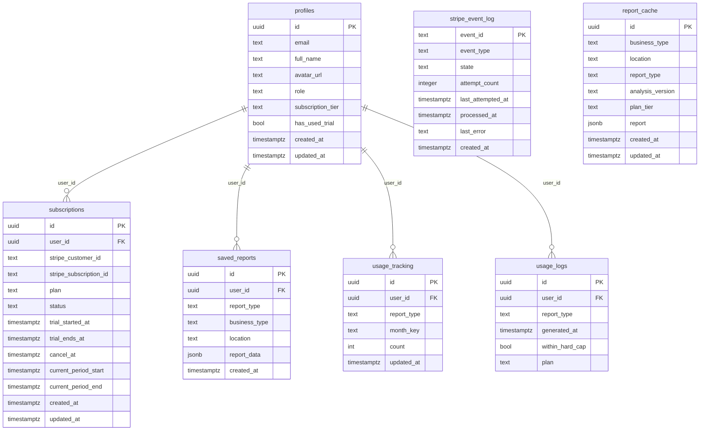

# Architecture

System overview and data flow diagrams for BizScope AI. All diagrams use Mermaid syntax (rendered on GitHub, GitLab, and most Markdown viewers).

---

## Technology Stack

| Layer | Technology | Purpose |
|---|---|---|
| Frontend | React 19 + TypeScript + Vite 6 | SPA, `?view=` routing |
| Hosting | Vercel | Static SPA + serverless functions |
| Database | Supabase (PostgreSQL) | Profiles, subscriptions, reports, quotas |
| Auth | Supabase Auth | Google OAuth + email/password |
| Payments | Stripe | Subscriptions, checkout, portal |
| AI | Google Gemini (via `@google/genai`) | Report generation |
| Email | Resend | Contact form transactional email |
| Analytics | GA4 + Microsoft Clarity | Product analytics + session recording |

---

## Diagram 1: System Components

---

## Diagram 2: Authentication Flow

The `profiles` row is auto-created by the `on_auth_user_created` trigger on `auth.users` INSERT (migration `20260604000002_capture_auth_trigger.sql`).

---

## Diagram 3: Report Generation Flow

---

## Diagram 4: Stripe Subscription Lifecycle

---

## Diagram 5: Plan Entitlement Resolution

This logic lives entirely in `src/utils/planUtils.ts → getEffectivePlan()`. All feature gates call this function — never the raw DB tier directly.

---

## Diagram 6: Quota Enforcement (Server-Side)

**Fail-open design:** if `checkStandardQuota` or `checkTrialQuota` throws a DB exception, the check returns `{ allowed: true }`. The report is generated. This prevents DB downtime from blocking users. The risk is a small number of extra reports during outages.

---

## Database Schema Relationships

---

## Key Design Decisions

**`?view=` routing instead of React Router:** The SPA was built without a routing library to reduce bundle size and avoid router configuration complexity for a relatively small number of views. The SPA catch-all rewrite in `vercel.json` handles direct URL access.

**Fail-open quota:** Both `checkStandardQuota` and `checkTrialQuota` return `{ allowed: true }` on DB error. The alternative (fail-closed) would block users during database outages. Given the low monetary cost of a few extra Gemini API calls versus the user experience cost of blocking, fail-open was chosen.

**Client-side `localStorage` quota shadow:** `usageTrackerService.ts` maintains a localStorage copy of usage for instant UI feedback (so the UI can disable the "Generate" button immediately without waiting for a server round-trip). This is supplementary — the server is authoritative. Discrepancies are corrected when `/api/usage-summary` is fetched.

**`ProPlus` vs `Pro+` mapping:** Postgres `CHECK` constraints require identifiers without special characters. The DB enum uses `ProPlus`; the UI and Stripe display `Pro+`. The mapping lives in `PLAN_TO_DB_TIER` and `DB_TIER_TO_PLAN` in `src/utils/planUtils.ts` and `api/stripe/_shared.ts`. All code must go through these maps.

**Webhook idempotency via `stripe_event_log`:** Stripe may deliver the same webhook event multiple times (at-least-once delivery). The `begin_stripe_event` RPC uses a PRIMARY KEY constraint on `event_id` to ensure only one handler claims each event. Subsequent deliveries of the same event ID return `processed` immediately.

**`protect_profile_columns` trigger:** Prevents authenticated users from escalating their own `role` or `subscription_tier` via the anon key client. The trigger inspects the session's JWT role and blocks writes to sensitive columns unless the session is `service_role`.

---

## Security Boundaries

| Boundary | Enforcement |
|---|---|
| Client → Supabase (anon) | RLS policies on all tables; `protect_profile_columns` trigger |
| Client → Vercel API functions | `verifyAuth()` validates Supabase JWT before any privileged operation |
| Stripe → Vercel webhook | `stripe.webhooks.constructEvent()` verifies HMAC signature using `STRIPE_WEBHOOK_SECRET` |
| Vercel → Supabase writes | `SUPABASE_SERVICE_ROLE_KEY` used only in serverless functions (never exposed to client) |
| Gemini API | `GEMINI_API_KEY` is a server-only env var (no `VITE_` prefix) |
